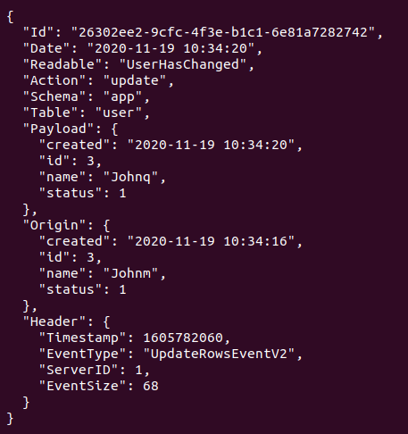
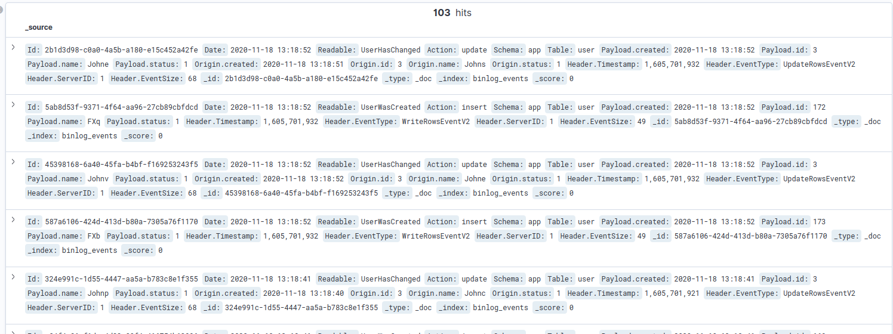

# Binlog parser and dispatcher

This tools checks Binlogs continuously and transforms every database action to Events, that are pushed to a message broker (rabbitMq) and to Elastic search.

## It listens... and publishes

the `producer` service is a long running process that listens to database operations and builds events on top of it.

It then publishes them to rabbitmq.



## It subscribes... and let subscribe

### Publicly

One exchange is [fanout](https://www.rabbitmq.com/tutorials/tutorial-three-go.html): to allow every interested application to subscribe to events in real time.


### Internaly

Another exchange is [direct](https://www.rabbitmq.com/tutorials/tutorial-four-go.html), and for internal purpose: its a fifo queue, consumed by an internal service (consumer) that saves all events to elastic search, for analytics and persistence.



## Run it

```bash
git clone https://github.com/xefiji/dblogger

cd dblogger

cp .env.dist .env # then edit .env vars

make build

make run_all
```

## Monit

```bash
make logs_all # all container's logs

make ps_all # all container's status

make stop_all # stop playing
```

# Todo

- [ ] todo internal exchange should be a different user
- [ ] todo two steps build dockerfile
- [ ] todo observer pattern on consumer